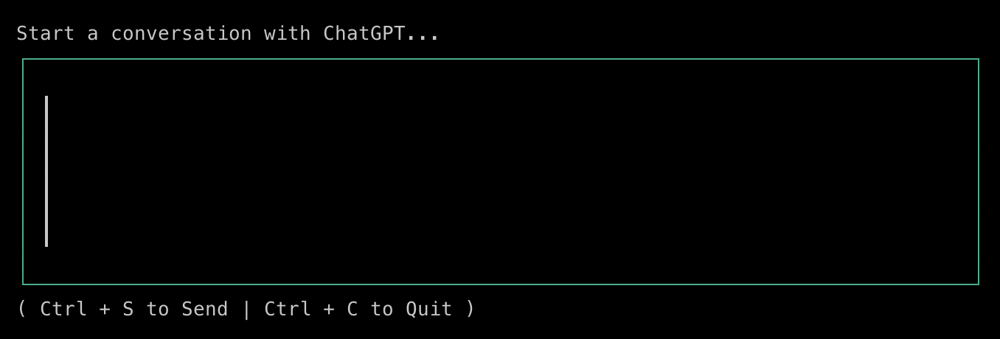
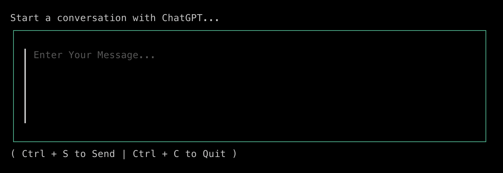

# Command Line ChatGPT 

## Demo


## Features

- **Send Messages to ChatGPT** - Queries the ChatGPT API with a message and receive a completion.
- **Chat History** - View historical queries and their corresponding completions.

## Prerequisites and Setup

### OpenAI API Key Generation

1. Visit https://platform.openai.com/account/api-keys
1. Select `+ Create New Secret Key`

### Use the Key

1. Create a .env file in the directory as the executable / main.go.
    ```sh
    cp .env-example .env
    ```
1.  Set `OPENAI_API_TOKEN` with the generated key.
    ```sh
    OPENAI_API_TOKEN=${SET_ME}
    ``` 

## Releases

Done by [GoReleaser](https://goreleaser.com/quick-start/) through [GitHub Actions](https://goreleaser.com/ci/actions/).

- [v1.0.0](https://github.com/nicnicknicky/openaicli/releases)

## Resources and References

### Demo GIF Recording

- [GitHub - charmbracelet/vhs](https://github.com/charmbracelet/vhs)

### OpenAI

- [OpenAI API Reference - Completions](https://platform.openai.com/docs/api-reference/completions)
- [GoDocs - sashabaranov/go-openai](https://pkg.go.dev/github.com/sashabaranov/go-openai)

### TUI

- [YouTube - Charm CLI](https://www.youtube.com/@charmcli/videos)
- [GitHub - charmbracelet/bubbletea](https://github.com/charmbracelet/bubbletea)
- [GitHub - charmbracelet/wizard-tutorial](https://github.com/charmbracelet/wizard-tutorial)
- [GitHub - charmbracelet/bubbles](https://github.com/charmbracelet/bubbles)
- [GitHub - charmbracelet/glamour](https://github.com/charmbracelet/glamour)
- [GitHub - bashbunni/pjs](https://github.com/bashbunni/pjs)
- [GitHub - mergestat/scribe](https://github.com/mergestat/scribe/blob/main/internal/repl/repl.go)

## Bugs

The textarea model initialises with the placeholder message obscured, only appearing after a backspace.

<ins>**Got**</ins>



<ins>**Want**</ins>




